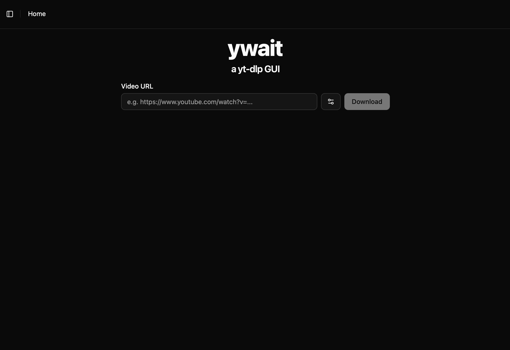
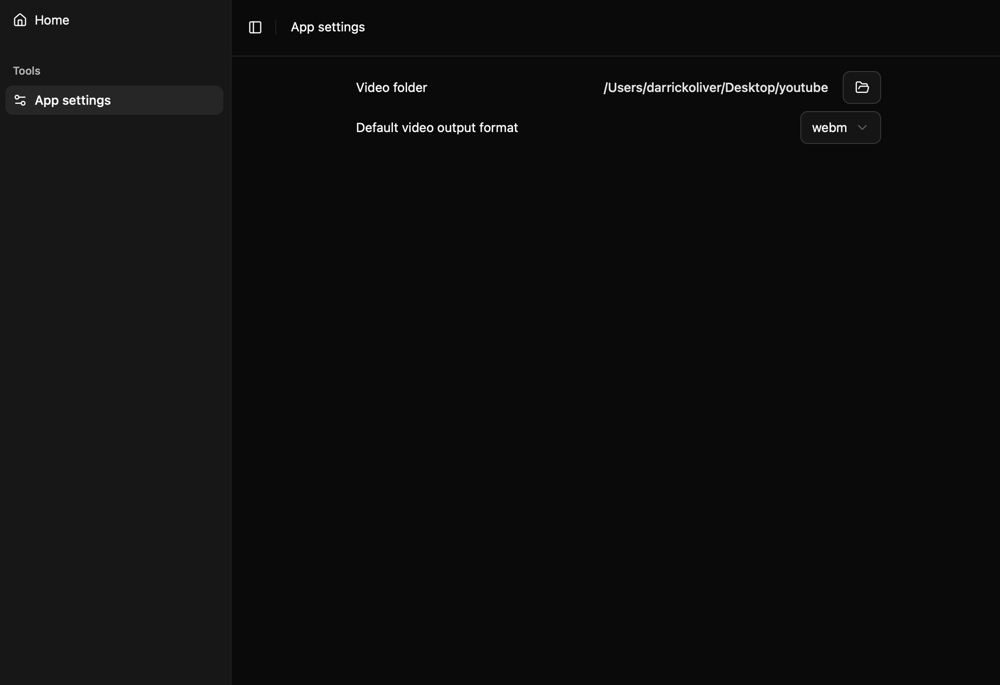

# ywait

I got tired of using the yt-dlp CLI to download YouTube videos so I made this clean and simple UI.

## Screenshots

## User setup

### Pre-requistes

1. Install [yt-dlp](https://github.com/yt-dlp/yt-dlp)
   - (Eventually will be replaced with a download manager in the app)
   - WINDOWS: Add yt-dlp.exe to your [PATH](https://www.architectryan.com/2018/03/17/add-to-the-path-on-windows-10/), you can run `yt-dlp --version` in PowerShell to see if it's working
1. Make sure to also install [ffmpeg and ffprobe](https://www.ffmpeg.org/), mentioned on the yt-dlp GitHub

### Installing the application

1. Check the releases page for binaries

## Developer setup

### Pre-requistes

1. Install [yt-dlp](https://github.com/yt-dlp/yt-dlp)
1. Install [node](https://nodejs.org/en/download) if it isn't installed already
1. Install [cargo](https://doc.rust-lang.org/cargo/getting-started/installation.html)

### Bundling

1. Clone this repository
1. Run `npm install`
1. Run `npx tauri build` or `npx tauri dev`

NOTE: Only tested on MacOS

## Upcoming Features

- Better app icon (current was ai generated)
- Option to download video and audio/just audio
- Select a root folder should be the first thing to come up when you first open the app
- Change how download bar looks
- Store metadata on videos downloaded
  - Keep info about uploader, thumbnail, likes, categories, tags etc?
- Queue downloads/download playlists
- [STRETCH] Google login
- [STRETCH] View videos as if it were Netflix or YouTube home screen

### Download Options

- Add option to manually input video/audio format
